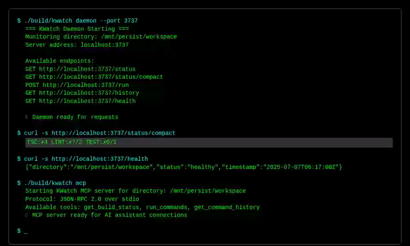

# 🔍 KWatch

A fast, lightweight project monitoring tool for TypeScript/JavaScript projects. Provides real-time build status through a TUI panel and HTTP API optimized for AI agent polling.

## 📸 Demo



*Interactive demo showing KWatch's web interface and features*


*Terminal demo showing daemon startup and API usage*

<details>
<summary>🎬 Live Demo Output</summary>

```bash
🔍 KWatch Demo - Project Monitoring Tool
========================================

📦 Building KWatch...
Installing dependencies...
Building kwatch...
Binary built: build/kwatch

🚀 Starting KWatch Daemon...
=== KWatch Daemon Starting ===
Monitoring directory: /mnt/persist/workspace
Server address: localhost:3737

Available endpoints:
  GET  http://localhost:3737/status
  GET  http://localhost:3737/status/compact
  POST http://localhost:3737/run
  GET  http://localhost:3737/history
  GET  http://localhost:3737/health

📊 Testing API Endpoints...

1. Compact Status:
TSC:✗4 LINT:✗7/2 TEST:✗0/1

2. Full Status (JSON):
{
  "status": "ok",
  "directory": "/mnt/persist/workspace",
  "timestamp": "2025-07-07T05:34:00Z",
  "commands": {
    "lint": {
      "passed": false,
      "issue_count": 7,
      "duration": "1.7s"
    },
    "test": {
      "passed": false,
      "issue_count": 1,
      "duration": "304.7ms"
    },
    "tsc": {
      "passed": false,
      "issue_count": 4,
      "duration": "2.2s"
    }
  }
}

💻 CLI Commands:
Status command: TSC:✗4 LINT:✗7/2 TEST:✗0/1

🤖 AI Agent Integration Example:
status=$(curl -s http://localhost:3737/health)
if [ "$status" = "ok" ]; then
    echo "Project is healthy, proceeding..."
else
    echo "Project has issues, checking details..."
    curl -s http://localhost:3737/status | jq .
fi
```

</details>

<details>
<summary>🎨 Visual Overview</summary>

```
┌─────────────────────────────────────────────────────────────────────────────────┐
│                          🔍 KWatch - Project Monitor                            │
├─────────────────────────────────────────────────────────────────────────────────┤
│                                                                                 │
│  📊 Real-time Status:  TSC:✗4 LINT:✗7/2 TEST:✗0/1                            │
│                                                                                 │
│  🌐 HTTP API Endpoints:                                                         │
│    GET  /status         - Full JSON status                                     │
│    GET  /status/compact - One-line status                                      │
│    GET  /history        - Command execution history                            │
│    POST /run            - Trigger manual run                                   │
│    GET  /health         - Health check                                         │
│                                                                                 │
│  ⚡ Features:                                                                   │
│    ✅ Real-time TUI Panel    ✅ File Watcher                                   │
│    ✅ HTTP API (<100ms)      ✅ Command History                                │
│    ✅ Global Installation    ✅ Cross-platform                                 │
│                                                                                 │
│  💻 Commands Monitored:                                                         │
│    • TSC  - npx tsc --noEmit 2>&1                                              │
│    • LINT - bun run lint                                                       │
│    • TEST - bun run test                                                       │
│                                                                                 │
└─────────────────────────────────────────────────────────────────────────────────┘
```

</details>

## Features


- **Real-time TUI Panel** - Monitor TSC, Lint, and Test status with live updates
- **File Watcher** - Automatically runs checks when files change
- **HTTP API** - Fast polling endpoints for AI agents (<100ms response)
- **Command History** - Track all runs with timestamps and results
- **Global Installation** - Install like any system command (`cp`, `ls`, etc.)
- **Cross-platform** - Works on Linux, macOS, and Windows
- **MCP Integration** - Full Model Context Protocol support for AI assistants

## Installation

### Quick Install (Global)
```bash
make install
```

### User Install (No sudo required)
```bash
make install-user
# Add ~/bin to your PATH if not already there
export PATH="$HOME/bin:$PATH"
```

### From Source
```bash
git clone <repository>
cd kwatch
make build
./build/kwatch .
```

## Usage

### Basic Commands

```bash
# Start TUI panel in current directory
kwatch .

# Start TUI panel in specific directory
kwatch /path/to/project

# Get current status (JSON)
kwatch . status

# Get compact status (one-line)
kwatch . status --compact

# View command history
kwatch . history

# Force manual run
kwatch . run

# Start background daemon
kwatch . daemon --port 3737
```

### TUI Panel Controls

- **q** - Quit
- **r** - Refresh/Manual run
- **h** - Show help
- **s** - Switch to status view
- **l** - Switch to logs view
- **↑/↓** - Navigate (in history/logs)

### HTTP API for AI Agents

When running in daemon mode, the following endpoints are available:

- `GET /quick` - Ultra-fast health check (just "ok")
- `GET /status` - Full JSON status
- `GET /status/compact` - Single-line status: `TSC:✓0 LINT:✗5 TEST:✓0`
- `POST /run` - Trigger manual run
- `GET /history` - Command execution history
- `GET /metrics` - Performance metrics

## 🤖 Model Context Protocol (MCP) Integration

KWatch provides full MCP server support, allowing AI assistants like Claude to directly monitor your project's build status.

### MCP Server Features

- **Real-time build monitoring** - Get current TypeScript, lint, and test status
- **Command execution** - Trigger builds manually through AI assistants
- **History access** - Review past command executions and results
- **JSON-RPC 2.0** - Standard protocol over stdio for maximum compatibility

### Quick MCP Setup

1. **Start MCP Server:**
```bash
./build/kwatch mcp /path/to/your/project
```

2. **Configure Claude Desktop** (`~/.config/claude-desktop/config.json`):
```json
{
  "mcpServers": {
    "kwatch": {
      "command": "kwatch",
      "args": ["mcp", "/path/to/your/project"],
      "env": {}
    }
  }
}
```

3. **Use in Claude:**
```
"Check the build status of my project"
"Run the linting command"
"Show me the recent command history"
```

### Available MCP Tools

<details>
<summary>📋 Complete MCP Tool Reference</summary>

#### 1. `get_build_status`
Get current build status with optional formatting.

**Parameters:**
- `format` (optional): `"compact"` or `"detailed"` (default: `"detailed"`)

**Example Usage:**
```json
{
  "name": "get_build_status",
  "arguments": {
    "format": "compact"
  }
}
```

**Response:**
```
TSC:✗4 LINT:✗7/2 TEST:✗0/1
```

#### 2. `run_commands`
Execute build commands manually.

**Parameters:**
- `command` (optional): `"all"`, `"tsc"`, `"lint"`, or `"test"` (default: `"all"`)

**Example Usage:**
```json
{
  "name": "run_commands",
  "arguments": {
    "command": "lint"
  }
}
```

**Response:**
```json
{
  "timestamp": "2025-07-07T06:17:00Z",
  "command": "lint",
  "results": {
    "lint": {
      "passed": false,
      "issue_count": 7,
      "duration": "1.7s",
      "timestamp": "2025-07-07T06:17:00Z"
    }
  }
}
```

#### 3. `get_command_history`
Get history of executed commands.

**Parameters:**
- `limit` (optional): Maximum entries to return (default: 10)
- `filter` (optional): Filter by command type: `"tsc"`, `"lint"`, or `"test"`

**Example Usage:**
```json
{
  "name": "get_command_history",
  "arguments": {
    "limit": 5,
    "filter": "tsc"
  }
}
```

</details>

### MCP Configuration Examples

<details>
<summary>⚙️ Advanced MCP Configurations</summary>

#### Development Environment
```json
{
  "mcpServers": {
    "kwatch-dev": {
      "command": "/usr/local/bin/kwatch",
      "args": ["mcp", "/home/user/projects/my-app"],
      "description": "Development project monitoring",
      "env": {
        "NODE_ENV": "development"
      }
    }
  }
}
```

#### Multiple Projects
```json
{
  "mcpServers": {
    "kwatch-frontend": {
      "command": "kwatch",
      "args": ["mcp", "/projects/frontend"],
      "description": "Frontend build monitoring"
    },
    "kwatch-backend": {
      "command": "kwatch",
      "args": ["mcp", "/projects/backend"],
      "description": "Backend build monitoring"
    }
  }
}
```

#### Production Monitoring
```json
{
  "mcpServers": {
    "kwatch-prod": {
      "command": "/usr/local/bin/kwatch",
      "args": ["--dir", "/var/www/app", "mcp"],
      "description": "Production build monitoring",
      "env": {
        "NODE_ENV": "production"
      }
    }
  }
}
```

</details>

### AI Agent Integration

<details>
<summary>🤖 Real-world AI Agent Examples</summary>

**Quick Status Check:**
```bash
curl -s http://localhost:3737/status/compact
# Output: TSC:✗4 LINT:✗7/2 TEST:✗0/1
```

**Health Check Before Operations:**
```bash
# Check if project is healthy before running
status=$(curl -s http://localhost:3737/health)
if [ "$status" = "ok" ]; then
    echo "Project is healthy, proceeding..."
else
    echo "Project has issues, checking details..."
    curl -s http://localhost:3737/status | jq .
fi
```

**Continuous Monitoring Loop:**
```bash
#!/bin/bash
# AI agent monitoring script
while true; do
    status=$(curl -s http://localhost:3737/status/compact)
    echo "[$(date)] Status: $status"

    if [[ $status == *"✗"* ]]; then
        echo "Issues detected, triggering analysis..."
        curl -s http://localhost:3737/history | jq '.history[0]'
    fi

    sleep 30
done
```

**Integration with CI/CD:**
```bash
# Pre-commit hook example
kwatch_status=$(curl -s http://localhost:3737/status/compact)
if [[ $kwatch_status == *"✗"* ]]; then
    echo "❌ Build issues detected: $kwatch_status"
    echo "Fix issues before committing"
    exit 1
else
    echo "✅ All checks passed: $kwatch_status"
fi
```

</details>

## Commands Monitored

- **TSC** - `npx tsc --noEmit 2>&1`
- **Lint** - `bun run lint`
- **Test** - `bun run test`

## Output Format

### JSON Status
```json
{
  "directory": "/path/to/project",
  "timestamp": "2024-01-01T12:00:00Z",
  "commands": {
    "tsc": {
      "passed": true,
      "issue_count": 0,
      "duration": "1.2s",
      "timestamp": "2024-01-01T12:00:00Z"
    },
    "lint": {
      "passed": false,
      "issue_count": 5,
      "duration": "0.8s",
      "timestamp": "2024-01-01T12:00:00Z"
    },
    "test": {
      "passed": true,
      "issue_count": 0,
      "duration": "2.1s",
      "timestamp": "2024-01-01T12:00:00Z"
    }
  }
}
```

### Compact Status
```
TSC:✓0 LINT:✗5 TEST:✓0
```

- **✓** = Passed
- **✗** = Failed
- **Number** = Issue count (errors/warnings/failures)

## Development

### Build Commands
```bash
make build        # Build binary
make dev          # Build with race detection
make test         # Run tests
make clean        # Clean build artifacts
make build-all    # Cross-compile for all platforms
```

### Requirements
- Go 1.21+
- Node.js/Bun for the monitored commands
- Make for build automation

## Architecture

- **CLI** - Cobra-based command structure
- **TUI** - Bubbletea terminal interface
- **Runner** - Parallel command execution
- **Server** - HTTP API for agent polling
- **Watcher** - File system monitoring

## 🎯 Interactive Demo

Try KWatch yourself! Here's a complete walkthrough:

<details>
<summary>📋 Step-by-Step Demo</summary>

### 1. Build and Install
```bash
# Clone and build
git clone <repository>
cd kwatch
make build

# The binary is now available at ./build/kwatch
```

### 2. Start Monitoring
```bash
# Start the daemon
./build/kwatch daemon --port 3737

# In another terminal, check status
curl -s http://localhost:3737/status/compact
# Output: TSC:✗4 LINT:✗7/2 TEST:✗0/1
```

### 3. Explore API Endpoints
```bash
# Full status with timing
curl -s http://localhost:3737/status | jq .

# Command history
curl -s http://localhost:3737/history | jq '.history[0:2]'

# Health check
curl -s http://localhost:3737/health
```

### 4. CLI Commands
```bash
# Direct status check (no daemon needed)
./build/kwatch status --compact

# View help
./build/kwatch --help

# Check command history
./build/kwatch history
```

</details>

<details>
<summary>🎬 Expected Output Examples</summary>

**Daemon Startup:**


```
=== KWatch Daemon Starting ===
Monitoring directory: /mnt/persist/workspace
Server address: localhost:3737

Available endpoints:
  GET  http://localhost:3737/status
  GET  http://localhost:3737/status/compact
  POST http://localhost:3737/run
  GET  http://localhost:3737/history
  GET  http://localhost:3737/health

Press Ctrl+C to stop the daemon
===============================
```

**API Response Example:**
```json
{
  "status": "ok",
  "directory": "/mnt/persist/workspace",
  "timestamp": "2025-07-07T05:34:00Z",
  "commands": {
    "lint": {
      "passed": false,
      "issue_count": 7,
      "duration": "1.7s"
    },
    "test": {
      "passed": false,
      "issue_count": 1,
      "duration": "304.7ms"
    },
    "tsc": {
      "passed": false,
      "issue_count": 4,
      "duration": "2.2s"
    }
  }
}
```

</details>

## Performance

- **TUI Updates** - Real-time, sub-second response
- **HTTP API** - <100ms response times
- **File Watching** - Debounced, efficient monitoring
- **Command Execution** - Parallel processing

## 📊 Benchmarks

| Operation | Response Time | Notes |
|-----------|---------------|-------|
| `/status/compact` | <50ms | Optimized for AI agents |
| `/status` | <100ms | Full JSON response |
| `/health` | <10ms | Ultra-fast health check |
| File change detection | <500ms | Debounced file watching |

## 🎬 Animation Demo

<details>
<summary>📺 KWatch in Action (ASCII Animation)</summary>

```
Frame 1: Starting KWatch
┌─────────────────────────────────────────┐
│ $ ./build/kwatch daemon --port 3737     │
│                                         │
│ === KWatch Daemon Starting ===         │
│ Monitoring: /mnt/persist/workspace      │
│ Server: localhost:3737                  │
│                                         │
│ [●○○] Initializing...                   │
└─────────────────────────────────────────┘

Frame 2: Daemon Running
┌─────────────────────────────────────────┐
│ === KWatch Daemon Running ===           │
│                                         │
│ 📊 Status: TSC:✗4 LINT:✗7/2 TEST:✗0/1 │
│                                         │
│ 🌐 API Endpoints Available:             │
│   GET  /status                          │
│   GET  /status/compact                  │
│   POST /run                             │
│   GET  /history                         │
│   GET  /health                          │
│                                         │
│ [●●●] Ready for requests                │
└─────────────────────────────────────────┘

Frame 3: API Request
┌─────────────────────────────────────────┐
│ $ curl localhost:3737/status/compact    │
│                                         │
│ TSC:✗4 LINT:✗7/2 TEST:✗0/1            │
│                                         │
│ ⚡ Response time: 45ms                  │
│                                         │
│ [●●●] Processing requests...            │
└─────────────────────────────────────────┘
```

</details>

## 🔧 Troubleshooting

<details>
<summary>Common Issues and Solutions</summary>

### Port Already in Use
```bash
# Check what's using the port
lsof -i :3737

# Use a different port
./build/kwatch daemon --port 8080
```

### TUI Not Working
```bash
# TUI requires interactive terminal
# Use daemon mode instead:
./build/kwatch daemon

# Or check status directly:
./build/kwatch status
```

### Commands Not Found
```bash
# Make sure you're in a Node.js/TypeScript project
ls package.json tsconfig.json

# Check if commands exist
npm run lint --dry-run
npm run test --dry-run
```

### API Not Responding
```bash
# Check if daemon is running
curl -s http://localhost:3737/health

# Check daemon logs
./build/kwatch daemon --port 3737 --verbose
```

</details>

## 🚀 Advanced Usage

<details>
<summary>Power User Features</summary>

### Custom Configuration
```bash
# Create config file
./build/kwatch config init

# Edit configuration
./build/kwatch config edit
```

### Multiple Projects
```bash
# Monitor different project
./build/kwatch daemon --dir /path/to/project --port 3738

# Multiple daemons for multiple projects
./build/kwatch daemon --dir ~/project1 --port 3737 &
./build/kwatch daemon --dir ~/project2 --port 3738 &
```

### Integration with IDEs
```bash
# VS Code task.json example
{
  "label": "KWatch Status",
  "type": "shell",
  "command": "curl -s http://localhost:3737/status/compact",
  "group": "build"
}
```

### Docker Integration
```dockerfile
# Add to your Dockerfile
COPY --from=kwatch /build/kwatch /usr/local/bin/
RUN kwatch daemon --host 0.0.0.0 --port 3737 &
```

</details>

## 📚 Resources

- [Demo HTML Page](./demo.html) - Interactive web demo
- [Demo Script](./demo-script.sh) - Automated demo runner
- [Screenshots](./screenshots/) - Terminal outputs and examples

## License

MIT License
